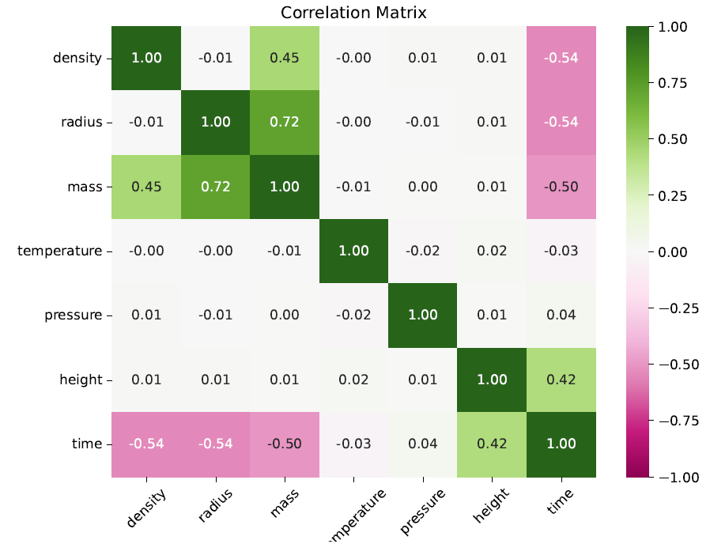
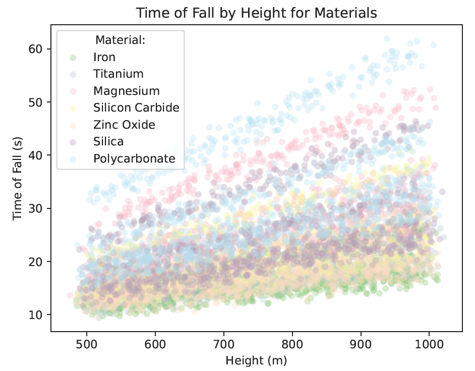
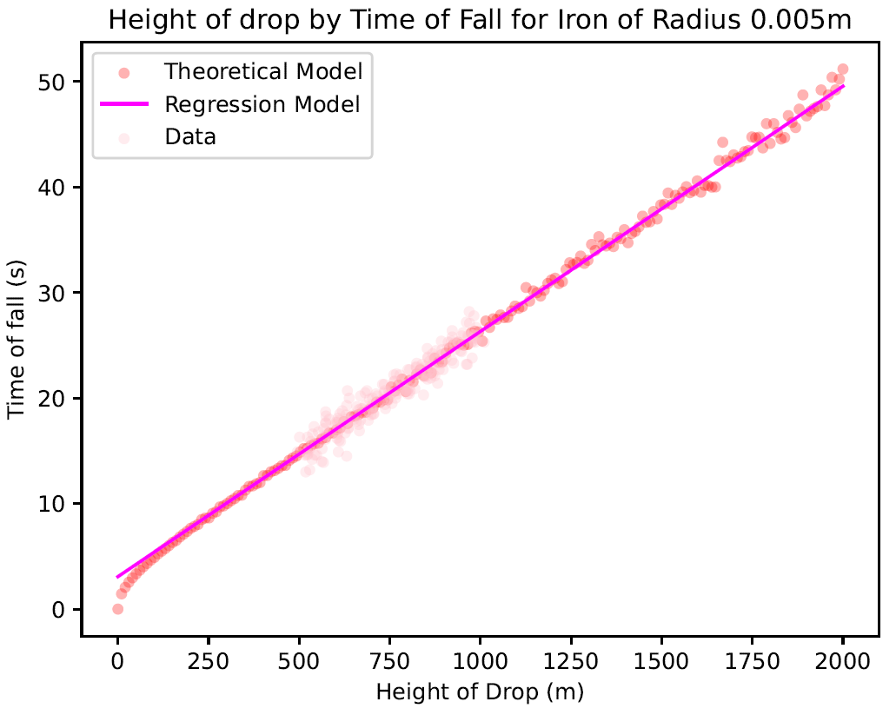

# linear-regression-analysis-free-fall
A multiple linear regression model is fitted to free fall data of balls of varying size, mass, density and other variables. The weight of each variable explored with a correlation matrix as well as the regression coefficients of the fitted model.

## Code Functions

- Reads large free fall data set removing any lines with missing or nonsensical data
- Displays **colour coded correlation matrix** of all pairs of 7 variables provided with coefficients
- Fits multiple linear regression model to the data set producing regression coefficients for each variable with:
    - Lasso and ridge regularization
    - Batch, stochastic and mini-batch gradient descent 
- Visualises residuals and model predicted fall time errors, comparing against theoretical free all equated times

## Skills 

- linear regression model fitting and testing
- solving of regression coefficients from a data matrix
- Evaluating models for selection from mean squared error and residuals
- scientific analysis

## Images

  
  
  
  

## Report

A full report PDF on the code methods, findings and analysis can be found in the main repository or here: 
[`Sarah_Straw_regression_free_fall_Report.pdf`](./images/Sarah_Straw_regression_free_fall_Report.pdf)

## Requirements

- Python 3
- numpy
- matplotlib
- pandas
- scikit-learn

## License

This project is shared under the [MIT License](./LICENSE).  
Please do not reuse this work for academic credit without permission.

## Author

Sarah Nicole Straw  
_BSc Physics, University of Bristol_  
GitHub: Sarah-Straw
